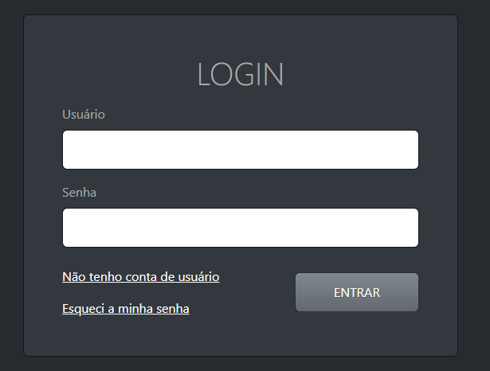
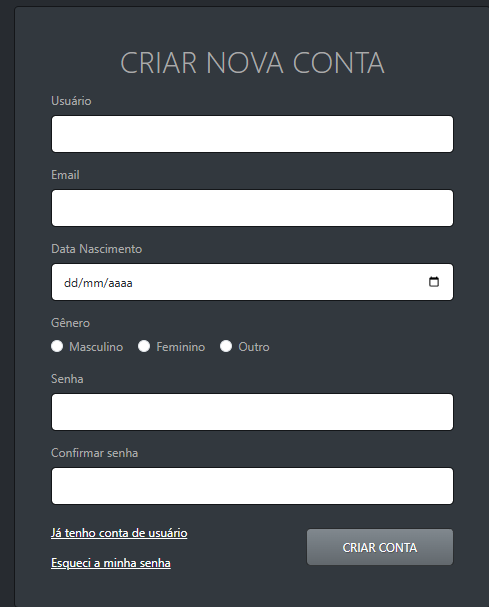
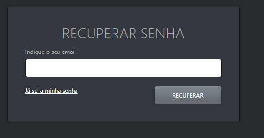
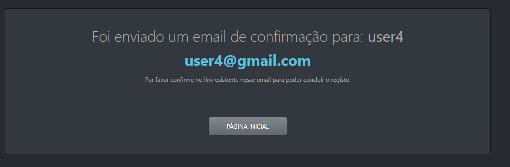
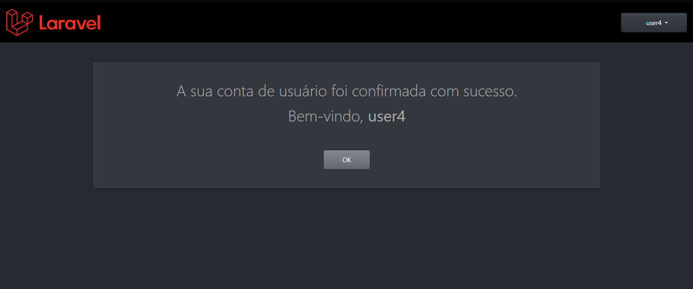
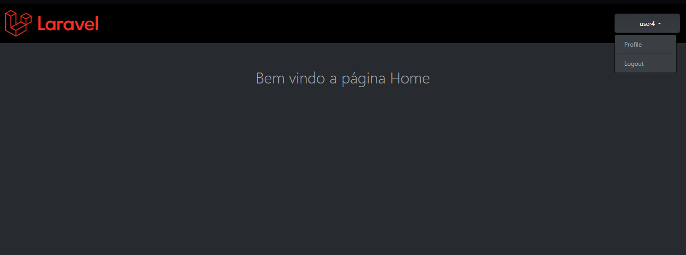
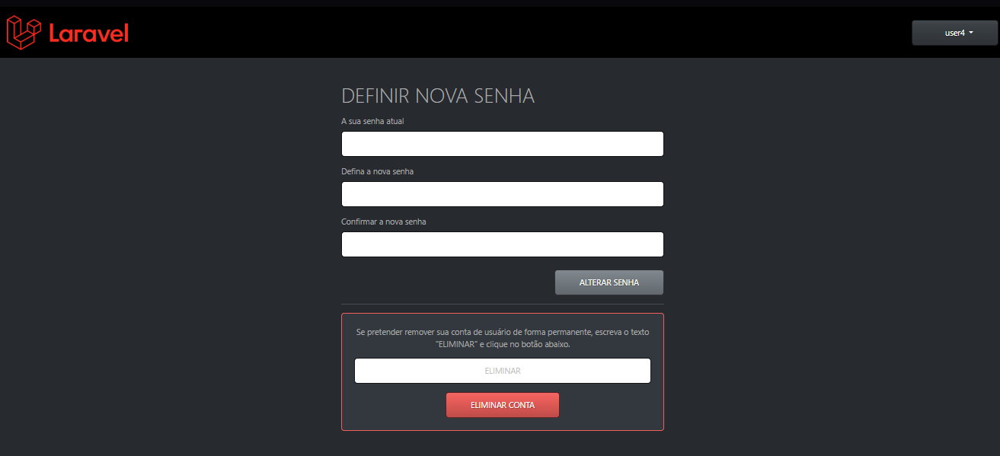

## Projeto Laravel Auth Fortify

## Requisitos

* PHP 8.2 ou superior - Conferir a versão: php -v
* Composer - Conferir a instalação: composer --version
* Node.js 22 ou superior - Conferir a versão: node -v
* GIT - Conferir se está instalado o GIT: git -v


## Objetivo

```sh
Desenvolver um sistema de autenticação seguro e completo em Laravel, que permita o gerenciamento do ciclo de vida do usuário, desde o cadastro até a exclusão da conta.

Sem usar as ferramentas do Breeze ou Fortify

```

### Fluxo de autenticação da aplicação
- 1 Fluxo: Cadastro de usuários (Nome, Email, Data de Nascimento, Genero, Senha)
- 2 Fluxo: Análise dos dados
- 3 Fluxo: Envio de email com link de confirmação
- 4 Fluxo: Confirmação do registro de usuario
- 5 Fluxo: Login automático após ser cadastrado
- 6 Fluxo: Login com Email e Senha
- 7 Fluxo: Recuperação de Senha
- 8 Fluxo: Perfil: Editar Senha -> Eliminação da conta do usuário
- 9 Fluxo: Logout
- 10 Fluxo: Rotas Protegidas após user autenticado 

## 🚀 Tecnologias Utilizadas
- Laravel 12
- PHP 8.2+
- Composer
- PostgreSQL
- Bootstrap 5.3

### Instalações

 ### Traduzir projeto para Portugues no laravel

 - https://github.com/lucascudo/laravel-pt-BR-localization

 - php artisan lang:publish
 - composer require lucascudo/laravel-pt-br-localization --dev
 - php artisan vendor:publish --tag=laravel-pt-br-localization


### TELA LOGIN



### TELA CADASTRAR USER



### TELA RECUPERAR SENHA



### TELA VERIFICAÇÃO DE EMAIL APÓS CADASTRAR



### TELA BOAS VINDAS APÓS VERIFICAÇÃO DE EMAIL



### TELA HOME



### TELA PERFIL


